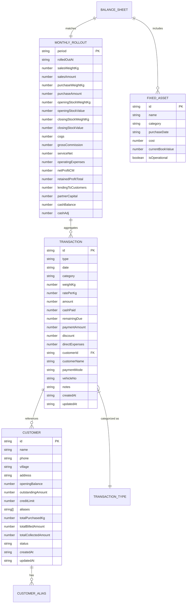
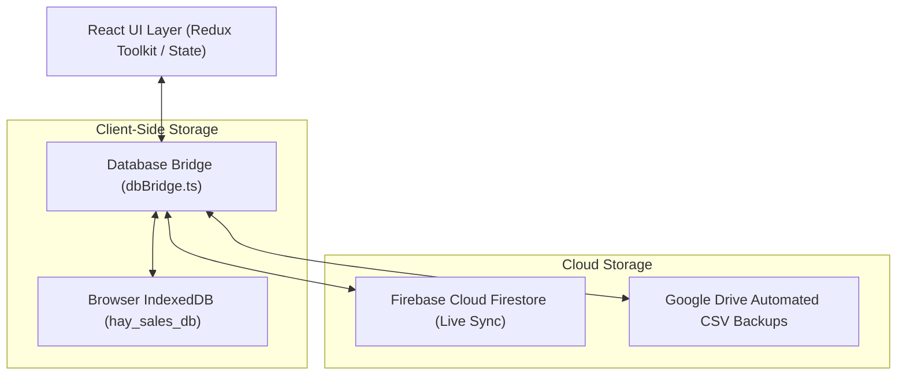
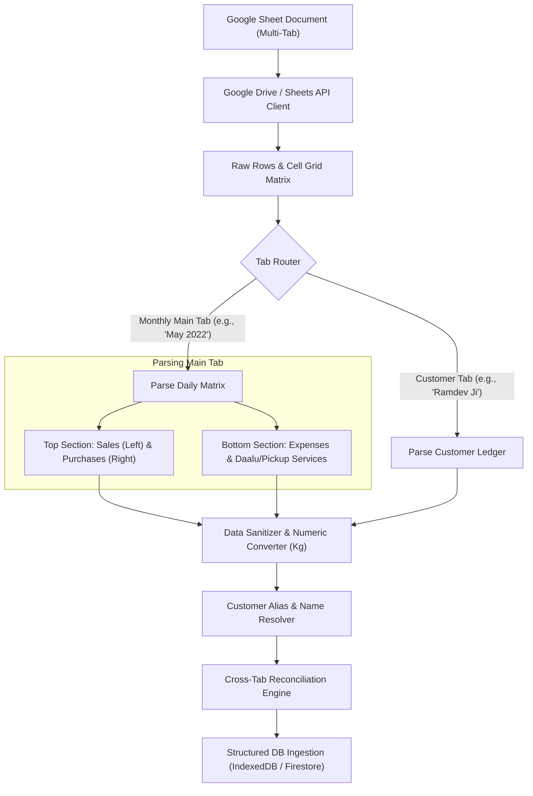
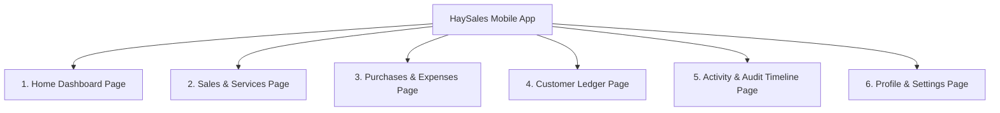
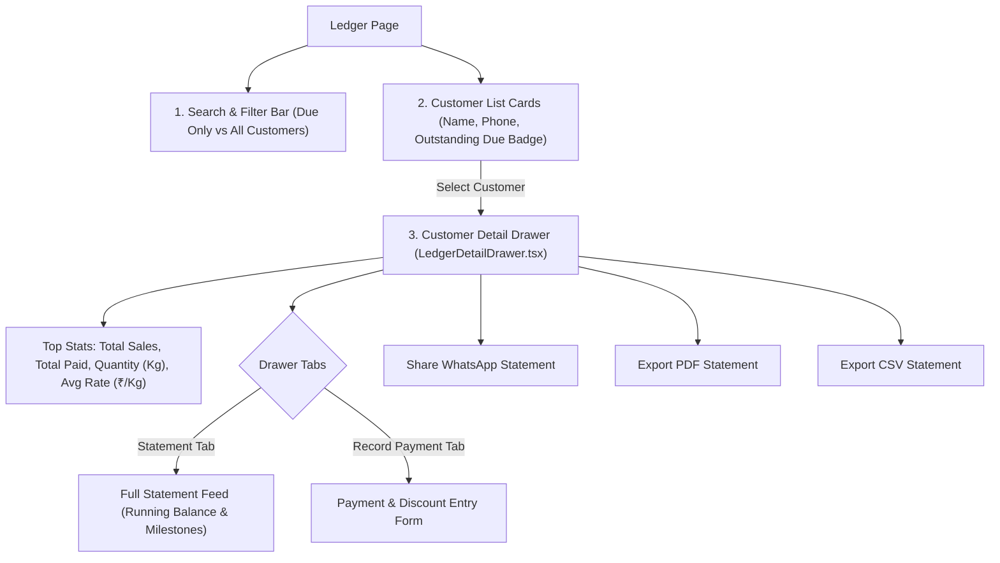
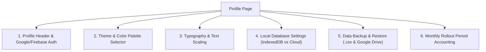

# HaySales — Master System Architecture & Business Knowledge Specification

This document is the exhaustive single source of truth for **HaySales** (Agricultural Fodder / Hay Trading, Distribution, Accounting, and Cloud/Local Database Management Platform).

---

## 1. Domain & Agricultural Business Model

HaySales is an enterprise-grade management platform built specifically for agricultural fodder and animal feed trading across India (primarily operating in the Rajasthan and Gujarat regions).

### 1.1 Weight & Pricing Standards

- **Weight**: Tracked, computed, and displayed **exclusively in Kilograms (Kg)** across all database entities, formulas, forms, APIs, and analytics.
- **Currency & Unit Rates**: Denominated in **Indian Rupees (₹)** and **₹ / Kg**.

### 1.2 Commodity Catalog

The business buys, stores, and sells various agricultural crop residues and cattle feed:

1. **Tuvar (Arhar / Pigeon Pea Fodder)**: High-protein dry legume straw.
2. **Chana (Gram / Chickpea Straw)**: Nutrient-dense fodder residue.
3. **B. Kutty (Bajra Kutti)**: Finely chopped pearl millet stalk chaff.
4. **M. Kutty (Makka Kutti)**: Chopped corn/maize fodder.
5. **Isabgol (Psyllium Husk / Fodder)**: Specialized crop residue.
6. **Gavatri (Green / Premium Fodder)**: High-grade nutritious cattle feed.
7. **Mustard / Rai Straw**: Winter oilseed crop residue.
8. **Soybean Straw**: Legume crop chaff.
9. **Wheat Straw (Gehun Bhusa)**: Standard staple roughage.
10. **Groundnut (Mungfali Chara / Straw)**: High-fat legume fodder.
11. **Others / Mixed**: Custom blended forage or miscellaneous crop residues.

---

## 2. Core Entities & Data Architecture



---

## 3. Database Architecture & Customer Setup

HaySales operates on a **Local-First, Cloud-Synced Hybrid Database Architecture**:



### 3.1 Database Collections (`hay_sales_db`)

1. **`customers`**:
   - Key path: `id` (e.g. `cust_001` or UUID).
   - Indexes: `name`, `phone`, `village`, `outstandingAmount`, `updatedAt`.
   - Stores master customer profiles, credit records, opening balances, and aliases.
2. **`transactions`**:
   - Key path: `id` (e.g. `tx_001` or UUID).
   - Indexes: `date`, `type`, `category`, `customerId`, `createdAt`.
   - Stores all Sales, Purchases, Services, Expenses, and Payments.
3. **`fixedAssets`**:
   - Key path: `id`.
   - Indexes: `category`, `isOperational`.
   - Stores capital equipment (Mahindra Bolero Pickup, yard boundary fence, tarpaulins).
4. **`monthlyRollout`**:
   - Key path: `period` (e.g. `2026_01`).
   - Indexes: `period`, `rolledOutAt`.
   - Stores closed monthly accounting summaries, inventory valuations, and balance sheet snapshots.
5. **`metadata`**:
   - Key path: `key`.
   - Stores schema version, seed state, last sync timestamp, and pending offline changes.

### 3.2 Customer Document Specification

```typescript
interface CustomerDocument {
  id: string; // Unique identifier
  name: string; // Canonical customer name
  phone?: string; // Contact mobile number
  village?: string; // Village / locality
  address?: string; // Physical delivery address
  openingBalance: number; // Historical balance brought forward (₹)
  outstandingAmount: number; // Current live receivable balance (₹)
  creditLimit?: number; // Optional credit threshold
  aliases: string[]; // Nicknames and phonetic variations
  totalPurchasedKg?: number; // Lifetime purchased volume (Kg)
  totalBilledAmount?: number; // Lifetime billed revenue (₹)
  totalCollectedAmount?: number; // Lifetime cash collections (₹)
  status: 'ACTIVE' | 'INACTIVE'; // Account state
  createdAt: string; // ISO timestamp
  updatedAt: string; // ISO timestamp
}
```

### 3.3 Customer Ledger Balance Integrity

Customer balances are tracked with continuous double-entry reconciliation:

$$\text{Live Outstanding Balance} = \text{Opening Balance} + \sum (\text{Sale Due}) + \sum (\text{Service Due}) - \sum (\text{Payment Amount}) - \sum (\text{Discount Allowed})$$

- **On `SALE`**: If $\text{Remaining Due} > 0$, increments `outstandingAmount`.
- **On `SERVICE`**: If $\text{Remaining Due} > 0$, increments `outstandingAmount`.
- **On `PAYMENT`**: Decrements `outstandingAmount` by $(\text{Payment Amount} + \text{Discount Allowed})$.
- **On Edit / Delete**: Recalculates deltas and updates the customer document atomically.
- **Alias Resolution**: Normalizes search terms by stripping regional honorifics (`Ji`, `Bhai`, `Patel`, `Dangi`, `Seth`) and matches against canonical customer IDs.

---

## 4. Google Sheets Ingestion & Pipeline Architecture

HaySales extracts, normalizes, and reconciles multi-tab Google Drive spreadsheets into structured database records:



### 4.1 Sheet Layouts & Parsing Rules

1. **Monthly Main Tabs** (e.g. `May 2022`, ..., `Aug 2026`):
   - **Left Columns (Sales)**: Date, Customer Name, Commodity Category, Weight (converted to Kg), Rate (₹/Kg), Total Amount (₹), Cash Received (₹), Due (₹).
   - **Right Columns (Purchases)**: Date, Supplier/Farmer Name, Commodity Category, Weight (converted to Kg), Buy Rate (₹/Kg), Total Purchase Cost (₹).
   - **Bottom Summary Matrix**:
     - Operating Expenses: Labor/Hamali, Fuel/Diesel, Yard Rent, Tarpaulins (Talpatri), Utilities.
     - Services: Daalu / Pickup transportation revenue and direct fuel outlays.
     - Closing balances: Closing stock valuation, customer lending, cash in hand.
2. **Customer Ledger Tabs**:
   - Date-wise debit entries (Sales/Services) and credit entries (Cash payments received, Settlement discounts).
3. **Sanitization Algorithms**:
   - **Regex String Cleaning**: Strips currency symbols (`₹`, `Rs.`), commas (`,`), whitespace, non-numeric characters, and textual remarks.
   - **Number Coercion**: Guarantees pure numeric values in **Kg** for weights and **₹** for amounts.
   - **Date Parser**: Normalizes regional date strings (`DD/MM/YYYY`, `DD-MM-YY`, `YYYY-MM-DD`) into ISO-8601 strings (`YYYY-MM-DD`).
   - **Integrity Reconciler**: Asserts that $\sum \text{Customer Tab Credits} = \sum \text{Main Tab Payments Received}$, and $\text{Opening Stock} + \text{Purchases} - \text{Sales} = \text{Closing Stock}$.

---

## 5. Pure Financial & Accounting Calculations

### 5.1 Dynamic Inventory Valuation (Weighted Average Cost)

For any operating period $m$:

$$\text{Available Weight (Kg)} = \text{Opening Stock Weight (Kg)} + \sum \text{Purchase Weight (Kg)}$$
$$\text{Available Cost (₹)} = \text{Opening Stock Value (₹)} + \sum \text{Purchase Amount (₹)}$$
$$\text{Weighted Average Buy Rate (₹/Kg)} = \begin{cases} \frac{\text{Available Cost}}{\text{Available Weight}}, & \text{if Available Weight} > 0 \\ 0, & \text{otherwise} \end{cases}$$

$$\text{Closing Stock Weight (Kg)} = \max(0, \text{Available Weight (Kg)} - \sum \text{Sales Weight (Kg)})$$
$$\text{Closing Stock Value (₹)} = \text{Closing Stock Weight (Kg)} \times \text{Weighted Average Buy Rate (₹/Kg)}$$
$$\text{Cost of Goods Sold (COGS)} = \text{Available Cost (₹)} - \text{Closing Stock Value (₹)}$$

---

### 5.2 Profit & Loss Formulas (Current Month - CM)

$$\text{Gross Commission (CM)} = \sum \text{Sales Amount} - \text{COGS}$$
$$\text{Service Net (CM)} = \sum \text{Service Billed Amount} - \sum \text{Direct Transport Costs}$$
$$\text{Operating Expenses (CM)} = \sum \text{Operating Expense Amount} + \sum \text{Customer Discounts Allowed}$$
$$\text{Net Profit (CM)} = \text{Gross Commission (CM)} + \text{Service Net (CM)} - \text{Operating Expenses (CM)}$$

---

### 5.3 Cumulative Retained Profit

$$\text{Retained Profit (Total)} = \text{Initial Opening Retained Profit} + \sum_{\text{all historical periods}} \text{Net Profit (CM)}$$

---

### 5.4 Balance Sheet & Cash in Hand Equation

$$\text{Total Assets} = \text{Total Liabilities \& Capital}$$

$$\text{Total Liabilities \& Capital} = \text{Partner Capital} + \text{Retained Profit} + \text{Vendor Liabilities}$$
$$\text{Non-Cash Assets} = \text{Customer Receivables} + \text{Closing Stock Value} + \text{Fixed Assets Value}$$
$$\text{Cash in Hand (Balancing Liquid Cash)} = \text{Total Liabilities \& Capital} - \text{Non-Cash Assets}$$
$$\text{Cash Adjustment} = \text{Cash in Hand (Current Period)} - \text{Cash in Hand (Prior Period)}$$

---

## 6. Application Pages & Complete Workflows



---

### 6.1 Home Dashboard Page (`HomePage.tsx`)

- **Period Filter Bar**:
  - `Month Mode`: Focuses on a single calendar month (Jan–Dec).
  - `YTD Mode`: Aggregates the entire active financial year.
- **Metric Cards**:
  1. **Estimated Net Profit Card**:
     - _Month Mode_: Strictly displays single-period profit ($\text{Net Profit (CM)}$).
     - _Year Mode_: Displays accumulated year-to-date profit.
     - Displays margin percentage, gross commission, pickup net, and operating expenses.
  2. **Assets & Liabilities Card**:
     - _Assets (Left)_: Fixed Assets breakdown (Pickup, Fence, Talpatri) + Closing Stock + Customer Receivables + Derived Cash in Hand = **Total Assets**.
     - _Liabilities & Capital (Right)_: Partner Capital + Retained Profit + Liabilities = **Total Liabilities & Capital**.
     - Guarantees $\text{Total Assets} = \text{Total Liabilities \& Capital}$.
  3. **Customer Outstanding Card**:
     - Total active receivables across all customers.
     - Period credit additions vs. period collections.
  4. **Commodity Breakdown Widget**:
     - Tabulates sales volume (Kg), purchase volume (Kg), average buy rate (₹/Kg), and estimated remaining inventory (Kg) by crop category.
  5. **Recent Transactions Widget**:
     - Live chronological feed of latest transactions with quick navigation.

---

### 6.2 Sales Page (`SalesPage.tsx`)

- **Tabs**: `Add Sale` vs `Add Service`.
- **Sale Form (`SaleForm.tsx`)**:
  - Fields: Date, Customer Autocomplete (search by name/phone/village or create inline), Crop Category, Weight (Kg), Rate (₹/Kg), Vehicle Number, Notes.
  - Auto-Calculations: $\text{Total Amount} = \text{Weight (Kg)} \times \text{Rate (₹/Kg)}$.
  - Cash / Credit Split: $\text{Remaining Due} = \max(0, \text{Total Amount} - \text{Cash Paid})$.
  - On Submit: Creates `SALE` transaction and updates customer's live receivable balance.
- **Service Form (`ServiceForm.tsx`)**:
  - Fields: Date, Customer, Service Type (Pickup Transportation, Daalu Loading, Machinery Hire), Billed Amount (₹), Cash Received (₹), Direct Fuel/Transport Expenses (₹).
  - Auto-Calculations: $\text{Remaining Due} = \max(0, \text{Billed Amount} - \text{Cash Received})$.
  - On Submit: Creates `SERVICE` transaction, tracks direct expenses, and updates customer dues.

---

### 6.3 Purchases Page (`PurchasesPage.tsx`)

- **Tabs**: `Add Purchase` vs `Add Expense`.
- **Purchase Form (`PurchaseForm.tsx`)**:
  - Fields: Date, Supplier / Farmer Name, Crop Category, Weight (Kg), Buy Rate (₹/Kg), Payment Mode (Cash, Bank, UPI), Vehicle Number.
  - Auto-Calculations: $\text{Total Purchase Cost} = \text{Weight (Kg)} \times \text{Buy Rate (₹/Kg)}$.
  - On Submit: Creates `PURCHASE` transaction and increases stock pool weight and cost.
- **Expense Form (`ExpenseForm.tsx`)**:
  - Fields: Date, Category (Hamali/Labor, Diesel, Repairs, Yard Rent, Talpatri/Tarpaulin, Utilities, Misc), Amount (₹), Payment Mode, Beneficiary/Notes.
  - On Submit: Creates `EXPENSE` transaction, deducted from gross margin.

---

### 6.4 Customer Ledger Page (`LedgerPage.tsx`) & Customer Statement Engine

The Customer Ledger is the primary accounts receivable management module. It allows managing customer credit balances, viewing full account histories, recording payments, and sharing official statements.



#### A. Master Customer List & Search Filters

- **Search Capabilities**: Instant search by customer name, phone number, village, or known alias.
- **Filter Toggles**:
  - `Due Only` (Default): Shows only customers who currently owe money ($\text{outstandingAmount} > 0$).
  - `All Customers`: Displays the complete customer master catalog alphabetically (A–Z).
- **Summary Metrics**:
  - Total Outstanding across all customers ($\sum \text{outstandingAmount}$).
  - Count of customers with active overdue balances.
- **Customer Card Information**:
  - Name, mobile number, village / location badge.
  - Formatted Outstanding Balance badge with color coding (Amber/Red for dues, Neutral/Green for zero balance).

---

#### B. Customer Detail Drawer (`LedgerDetailDrawer.tsx`)

Opening any customer launches a comprehensive full-height drawer:

1. **Header & Contact Actions**:
   - Customer name, village, and mobile number.
   - One-touch phone call and WhatsApp direct message buttons.
2. **Top Metrics Bar**:
   - **Total Sales**: Cumulative value of all outward sales billed to this customer (₹).
   - **Total Paid**: Cumulative cash & bank collections recorded from this customer (₹).
   - **Total Quantity**: Cumulative weight of fodder purchased (in **Kg**).
   - **Average Rate**: $\frac{\text{Total Billed Sales}}{\text{Total Weight (Kg)}}$ expressed in **₹ / Kg**.
   - **Current Due Badge**: Live outstanding balance.
3. **Tab 1: Chronological Account Statement (`TransactionHistoryList.tsx`)**:
   - **Deduplication Engine**: Merges and deduplicates transactions by unique ID and signature.
   - **Chronological Running Balance Algorithm**:
     - Begins from baseline opening debt / carried-forward balance.
     - For every `SALE` or `SERVICE`: adds $\text{Remaining Due}$ (or $\text{Billed Amount} - \text{Cash Paid}$) to running balance.
     - For every `PAYMENT`: subtracts $(\text{Cash Collected} + \text{Discount Allowed})$ from running balance.
     - Detects and visually highlights **Settlement Milestones** (points in time where the account was fully settled to ₹0 balance).
   - **Row Presentation**:
     - Date, Transaction Type (`SALE`, `SERVICE`, `PAYMENT`, `OPENING_BALANCE`).
     - Crop item, vehicle number, and custom notes.
     - Weight in **Kg** and Rate in **₹ / Kg**.
     - Debit (credit added) vs. Credit (payment received).
     - Running balance after the transaction.
4. **Tab 2: Fast Payment Collection (`LedgerPaymentForm.tsx`)**:
   - Fields:
     - `Date`: Defaults to today (editable).
     - `Payment Amount (₹)`: Cash/bank received upfront.
     - `Settlement Discount / Waive-off (Discount C2) (₹)`: Optional balance concession.
     - `Payment Mode`: Cash, UPI, Cheque, Bank Transfer.
     - `Receipt / Notes`: Optional payment notes.
   - **Dynamic Live Balance Preview**:
     $$\text{Remaining Due After Payment} = \text{Current Due} - (\text{Payment Amount} + \text{Discount})$$
   - **Atomic Submission**:
     - Creates a `PAYMENT` transaction in the database.
     - Deducts $(\text{Payment Amount} + \text{Discount})$ from customer's `outstandingAmount`.
     - Automatically updates the live liquid cash balance.

---

#### C. Statement Sharing & Export Features

1. **WhatsApp Statement Generator**:
   - Formats a human-readable text statement in Hindi/English:
     - Customer Name & Date.
     - Previous opening balance.
     - Detailed line items with date, crop, weight (Kg), rate (₹/Kg), and amounts.
     - Recent payments received.
     - Final net outstanding due payable.
   - Opens WhatsApp Web or WhatsApp Mobile App directly with pre-filled message.
2. **PDF Statement Export**:
   - Clean, printable invoice-style PDF document featuring business header, customer details, itemized table with Kg and ₹/Kg, and signature block.
3. **CSV Statement Export**:
   - RFC-4180 compliant CSV export for offline analysis or spreadsheet import.

---

### 6.5 Activity & Audit Timeline Page (`ActivityPage.tsx`)

- **Unified Transaction Feed**:
  - Shows every transaction in reverse chronological order.
  - Filter tabs: `Sales`, `Purchases & Expenses`, `Payments`.
  - Nature filters: `All`, `Cash`, `Credit`.
- **Edit Modal (`EditActivityModal.tsx`)**:
  - Edit transaction date, weight, rate, amount, cash paid, or notes.
  - Atomically recalculates customer balance deltas and stock changes.
- **Delete Transaction**:
  - Reverses credit and inventory impacts with confirmation safety.

---

### 6.6 Profile & System Operations Page (`ProfilePage.tsx`)

The Profile page is the administrative command center of the platform:



#### 1. Profile Header & Authentication (`ProfileHeader.tsx`)

- Displays user profile (Name, Phone Number, Enterprise Role).
- Firebase Authentication state (`onAuthStateChanged`): Phone login or Google Sign-In.
- Inline display name editing (`updateProfile`).
- Sign Out button with session clearance.

#### 2. Theme & Color Palettes (`ThemeSettings.tsx`)

- Dark Mode / Light Mode toggle with persistence.
- 5 Tailored Color Palettes:
  - **Agriculture Green** (Emerald - Default brand theme)
  - **Material Baseline** (Purple)
  - **Ocean Blue** (Blue)
  - **Harvest Amber** (Warm amber / grain theme)
  - **Crimson Rose** (Rose)

#### 3. Font & Text Scaling (`FontSettings.tsx`)

- 3 Accessible Font Sizes:
  - `Small`: Compact view for dense lists.
  - `Medium`: Default balanced mobile scaling.
  - `Large`: High legibility (+1 text scale) for outdoor/sunlight field use.

#### 4. Local Database & Offline Settings (`LocalDatabaseSettings.tsx`)

- **Database Engine Switcher**:
  - `Local Mode`: Uses browser IndexedDB (`hay_sales_db`). 100% offline, zero network latency.
  - `Server Mode`: Live Google Cloud Firestore connection with real-time sync.
- **Live Statistics Grid**: Displays document counts for Customers, Sales, Payments, Services, Purchases, Expenses, and Monthly Rollouts.
- **Actions**:
  - `Sync from Firestore`: Pulls latest remote cloud snapshot into local IndexedDB.
  - `Publish to Firestore`: Scans offline queue and pushes pending modifications to cloud.
  - `Clear Local Database`: Resets local browser IndexedDB storage.

#### 5. Database Backup & Restore (`DataBackupRestoreSettings.tsx`)

- **Direct Google Drive Integration**:
  - Connects to Google Drive folder using OAuth token.
  - Backup: Exports all 6 core datasets (`customers.csv`, `sales.csv`, `payments.csv`, `services.csv`, `purchases.csv`, `expenses.csv`) and uploads them directly to Google Drive.
  - Restore: Wipes current Firestore records and cleanly re-ingests datasets from Google Drive.
  - Local Fallback: Direct download/upload of `.csv` or `.json` files to user's device if cloud sign-in is unavailable.

#### 6. Monthly Rollout & Financial Closure (`MonthlyRolloutSettings.tsx`)

- **Period Accounting Workflow**:
  - Displays currently closed month (e.g. `August 2026`) and next target month to roll out (e.g. `September 2026`).
  - `Execute Rollout` Action:
    1. Evaluates all transactions in target month.
    2. Calculates Opening Stock $\rightarrow$ Purchases $\rightarrow$ Sales $\rightarrow$ Closing Stock.
    3. Computes Gross Commission, Service Net, Operating Expenses, Period Net Profit ($\text{CM}$), and cumulative Retained Profit.
    4. Validates balance sheet equality: $\text{Total Assets} = \text{Total Liabilities \& Capital}$.
    5. Saves permanent snapshot in `monthlyRollout` collection.
    6. Rolls forward closing stock, cash balance, and retained profit into next month's opening baseline.
  - **Historical Rollout Audit Trail**:
    - Expandable historical list of all closed periods showing: Period Net Profit, Cumulative Profit, Closing Stock Weight (Kg), Closing Stock Value (₹), Customer Receivables, Partner Capital, and Cash Balance.
