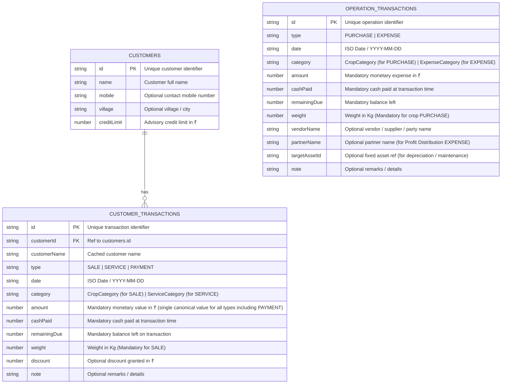

# HaySales Database, State & Architecture Guide

This document defines the simplified database schema, offline-first synchronization mechanism, Redux state management, and UI component architecture for HaySales.

---

## 1. Simplified 3-Table Database Schema

The database is streamlined into **three fundamental collections** (in IndexedDB and Cloud Firestore), eliminating legacy monthly backup tables and redundant collections:



### Key Domain Enums & Categories:

- **Transaction Types**:
  - **Customer Types**: `SALE`, `SERVICE`, `PAYMENT`
  - **Operations Types**: `PURCHASE`, `EXPENSE`
- **Crop Categories (`CropCategory`)** (`category` on `SALE` / `PURCHASE`):
  - `'Tuvar' | 'Chana' | 'B. Kutty' | 'M. Kutty' | 'Isabgol' | 'Others'`
- **Service Categories (`ServiceCategory`)** (`category` on `SERVICE`):
  - `'Pickup' | 'Tractor' | 'Commission' | 'Labor' | 'Transport' | 'Others'`
- **Expense Categories (`ExpenseCategory`)** (`category` on `EXPENSE`):
  - `'Fuel' | 'Maintenance' | 'Depreciation' | 'Interest' | 'Labor' | 'Food / Drink' | 'Tools' | 'Discount' | 'Profit Distribution' | 'Others'`

### Key Schema & Calculation Rules:

1. **Single Canonical Financial Field (`amount`)**:
   - `amount` is the single, universal monetary value attribute across ALL transaction types (including `PAYMENT`). There is **no separate `paymentAmount` field**.
   - `id`, `date`, `amount`, `cashPaid`, and `remainingDue` are mandatory on all transaction records (`CoreTransactionData`).
   - `weight` (in Kg) is mandatory on all physical crop transactions (`SALE` and `PURCHASE`).

2. **No Persisted `rate` Field (Pure On-the-Fly Calculation)**:
   - In transaction databases (`customer_transactions` and `operation_transactions`), we **only capture `amount` (₹) and `weight` (Kg)**.
   - `rate` (₹ / Kg) is **never stored in the database**; it is calculated on the fly strictly for crop transactions using `getRate(tx)`:
     $$\text{Rate (₹/Kg)} = \begin{cases} \frac{\text{Amount (₹)}}{\text{Weight (Kg)}} & \text{if isCropCategory(category) and Weight} > 0 \text{ and Amount} > 0 \\ \text{undefined} & \text{otherwise} \end{cases}$$
   - This ensures absolute consistency, zero storage redundancy, and eliminates discrepancies between raw input values and running financial totals.
   - `weight` exists **only** for physical crop transactions (`SALE` and `PURCHASE`). It does **not** apply to `SERVICE`, `PAYMENT`, or `EXPENSE`.

3. **Baseline Opening Stock (Jan-2026)**:
   - The opening inventory at the start of the 2026 accounting ledger is:
     - **Accounting Period**: January 2026 (`2026-01` / Month `0`)
     - **Crop Type / Category**: `Others`
     - **Weight**: **`13,528 Kg`**
     - **Amount**: **`₹ 141,097.04`**
     - **Upfront Calculated Rate**: $\frac{₹ 141,097.04}{13,528 \text{ Kg}} \approx \mathbf{₹ 10.43 / \text{Kg}}$
     - Other crop categories (`Tuvar`, `Chana`, `B. Kutty`, `M. Kutty`, `Isabgol`) baseline at `0 Kg` and `₹ 0.00`.

4. **Monthly Continuous Stock Rollout (Weighted Moving Average)**:
   - For any month $M$ and crop category $C$:
     $$\text{Opening Stock}(M, C) = \text{Closing Stock}(M-1, C)$$
     $$\text{Closing Weight}(M, C) = \text{Opening Weight}(M, C) + \sum \text{Purchased Weight}(M, C) - \sum \text{Sold Weight}(M, C)$$
     $$\text{Available Unit Cost} = \frac{\text{Opening Amount} + \sum \text{Purchased Amount}}{\text{Opening Weight} + \sum \text{Purchased Weight}}$$
     $$\text{Closing Amount}(M, C) = \max\left(0, \text{Closing Weight}(M, C) \times \text{Available Unit Cost}\right)$$

5. **Double-Entry Balance**: Customer outstanding is derived as:
   $$\text{Outstanding Balance} = \sum \text{Sales} + \sum \text{Services} + \text{Opening Balance} - \sum \text{Payments} - \sum \text{Discounts}$$

6. **No Monthly Backup Tables**: Rollouts, P&L, stock valuations, and balance sheets are dynamically calculated directly from the transaction ledger via date/month filtering and Redux selectors.

---

## 2. Offline-First Storage & Delta Sync Architecture

The app runs in **Offline-First Mode** by default. Reads and writes interact with local IndexedDB instantly with zero network latency.

```
┌────────────────────────────────────────────────────────┐
│                      UI Component                      │
└───────────────────────────┬────────────────────────────┘
                            │ (Dispatch mutation)
                            ▼
┌────────────────────────────────────────────────────────┐
│                   Redux / dbBridge                     │
└─────────────┬────────────────────────────┬─────────────┘
              │ 1. Instant Write           │ 2. Enqueue Delta
              ▼                            ▼
┌───────────────────────────┐    ┌───────────────────────┐
│     Local IndexedDB       │    │    pending_changes    │
│  • customers              │    │  • path: doc_path     │
│  • customer_transactions  │    │  • action: SET/DELETE │
│  • operation_transactions │    │  • data: payload      │
└─────────────┬─────────────┘    └───────────┬───────────┘
              ▲                              │
              │ 2. Pull latest data          │ 1. Push deltas
              │                              ▼
┌─────────────┴──────────────────────────────────────────┐
│                    Cloud Firestore                     │
└────────────────────────────────────────────────────────┘
```

### Can We Merge Sync & Publish?

**Yes!** Merging **Sync** and **Publish** into a single **"Sync with Cloud"** action provides the best user experience:

1. **Step 1 (Push Changes)**: Flush all pending local deltas from `pending_changes` to Cloud Firestore using batched writes.
2. **Step 2 (Pull Latest Data)**: Fetch latest server records from Firestore into IndexedDB.
3. **Step 3 (Clear Delta Queue)**: Clear `pending_changes` once confirmed.
4. **Step 4 (Refresh UI)**: Invalidate Redux RTK Query tags (`Customers`, `CustomerTransactions`, `OperationTransactions`) so the UI displays the newest data instantly.

### Reset Database Action:

- **Reset Local DB**: Wipes IndexedDB and the `pending_changes` queue, then re-downloads the complete dataset from Cloud Firestore.

---

## 3. Redux State Management

### 1. `filterSlice` (Timeline & Year Filtering)

Controls the global accounting time window:

```typescript
interface FilterState {
  selectedYear: number; // e.g., 2026
  selectedMonth: number; // 0 = Jan ... 11 = Dec
  filterMode: 'month' | 'ytd'; // 'month' or 'ytd' (Year To Date)
}

const initialState: FilterState = {
  selectedYear: 2026,
  selectedMonth: new Date().getMonth(),
  filterMode: 'month',
};
```

### 2. `themeSlice` (Theme Settings stored in `localStorage`)

Persists theme preferences locally without cluttering the backend database:

```typescript
interface ThemeState {
  mode: 'light' | 'dark' | 'system';
  scheme: 'green' | 'blue' | 'amber' | 'neutral';
  fontSize: 'small' | 'medium' | 'large';
}
```

- Preferences are saved directly to `localStorage` (`m3-theme-mode`, `m3-color-scheme`, `m3-font-size`) on change.
- The `ThemeProvider` reads from Redux/`localStorage` and sets M3 CSS custom properties (`var(--md-sys-...)`) on `:root`.

---

## 4. UI Architecture & Header Controls

### App Header (`TopAppBar`) Layout:

```
┌────────────────────────────────────────────────────────────────────────────────────────┐
│ [Avatar/Back] [Title]   │   [Year: 2026 ▼]   │   [Cloud Sync ☁ (3)]   [Theme ☀/🌙]    │
└────────────────────────────────────────────────────────────────────────────────────────┘
```

1. **Year Dropdown**:
   - Populated dynamically from `2026` up to `currentYear` (e.g., `[2026, 2027, ...]`).
   - Updates `selectedYear` in Redux `filterSlice`.
2. **Unified Sync Button**:
   - Displays an unsaved delta count badge (e.g. `3` when 3 mutations are queued locally).
   - Clicking triggers the 2-way merged sync (Push deltas $\rightarrow$ Pull server $\rightarrow$ Refresh store).
3. **Reset Option**:
   - Available in settings or header dropdown for clean resynchronization.

### Timeline Component (`PeriodFilterBar` / `Timeline`):

- Composable component placed on Dashboard, Ledger, and Transaction screens.
- Two-segment toggle:
  - **Month Selector**: Dropdown (`Jan` through `Dec` for the active year).
  - **YTD (Year-To-Date)**: Aggregates from January 1st of `selectedYear` to the current month.
- Fully bound to Redux `filterSlice` (`setFilterMode`, `setSelectedMonth`).
