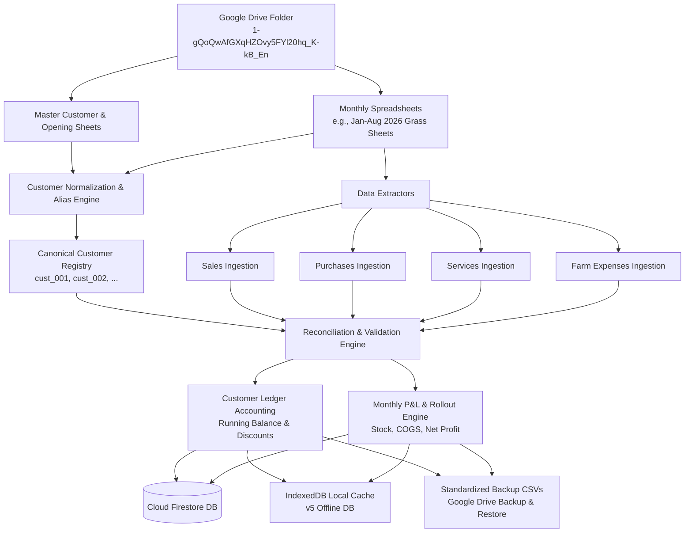

# HaySales Data Pipeline, Google Sheets Reconciliation & Historical Ingestion Guide

This document captures the end-to-end knowledge, architecture, business rules, and step-by-step procedures used to extract, normalize, reconcile, and import data from Google Sheets into the HaySales Firestore database and CSV backups.

It serves as the permanent reference manual for maintaining existing data and ingesting historical datasets (such as **2025 data**).

---

## 1. System & Data Architecture Overview

### Key IDs & Storage Locations

- **Google Drive Data Folder**: `1-gQoQwAfGXqHZOvy5FYl20hq_K-kB_En`
- **Master Customer Spreadsheet ID**: `1Q7NTxdeE7xQ7XBNGijn0xjoxkZK4Y1Glu3bMBfmxH-c`
- **Authentication**: Service Account JSON with Google Drive (`drive.readonly`) and Google Sheets (`spreadsheets.readonly`) scopes.

---

## 2. Customer Master & Alias Resolution

In traditional Google Sheets records, customer names have spelling variations, Gujarati/English phonetic variations, honorific variations (`bhai`, `ji`, `patel`), or village name suffixes (e.g., `Vedancha`, `Kubhasan`, `Khodla`).

### Alias Mapping Principles

1. **Canonical Primary Name**: All transaction records must link to a single canonical `customerId` and standardized name.
2. **Normalized Lookup**: Lowercase, strip punctuation (`.`, `-`), collapse consecutive spaces.
3. **Known Alias Rules**:
   - Phonetic variants: `Meghrajbhai` $\leftrightarrow$ `Megharajbhai`, `Hamirbhai` $\leftrightarrow$ `Hameerbhai`.
   - Inverted surname/given names: `Jafarkhan Khasa` $\rightarrow$ `Khasha Jafarkhan`.
   - Village disambiguation: When two people share a name, attach the village in parentheses, e.g. `Foshi Prabhubhai Maganbhai (Vedancha)`.
   - Single-name entities: `Akoliya` $\rightarrow$ merged to `Bhanwar Lal Akoliya` (or canonical Akoliya record).

### Retail Customer Mapping (`retail`, `dhuva retail`)

Walk-in or spot cash sales recorded as `retail` or `dhuva retail` in Google Sheets:

- Must **NOT** be discarded.
- Must be mapped to a dedicated **Retail Customer** account (e.g. `Retail Customer` / `Dhuva Retail`).
- Handled as cash sales transactions with immediate cash receipt (`cashPaid = amount`, `remainingDue = 0`) or tracked under retail ledger.

### Ignored / Non-Customer Rows in Sales Sheets

Only rows representing non-sales summaries, operational overheads, or formula totals are ignored from sales tables:

- `expenses` (parsed into Farm Expenses table instead)
- `intrest`, `interest` (financial overhead)
- `daalu diesel + depreciation` (vehicle/machinery operational cost)
- `total`, `grand total`, `subtotal` (sheet calculation rows)

---

## 3. Google Sheet Tab & Column Structure

### A. Monthly Sales & Grass Sheets

Each monthly spreadsheet (e.g., `Jan Grass 2026`, `Feb Grass 2026`, etc.) contains daily sales records:

| Column Index  | Field Name        | Type     | Notes / Parsing Logic                                                                               |
| :------------ | :---------------- | :------- | :-------------------------------------------------------------------------------------------------- |
| **Col A (0)** | Date              | `Date`   | Parsed into `YYYY-MM-DD`. If blank, carries forward date from previous row.                         |
| **Col B (1)** | Customer Name     | `String` | Run through Alias Dictionary to map to `customerId`.                                                |
| **Col C (2)** | Crop / Item       | `String` | Normalized to valid crop item (`Juvar`, `Makai`, `Bajra`, `Chana`, `Ghaun`, `Groundnut Hay`, etc.). |
| **Col D (3)** | Weight (kg)       | `Number` | Weight in kilograms. Filter out non-numeric/empty cells.                                            |
| **Col E (4)** | Total Amount (₹)  | `Number` | Total sale value ($=\text{Weight} \times \text{Rate}$).                                             |
| **Col F (5)** | Cash Received (₹) | `Number` | Cash paid immediately at time of purchase.                                                          |
| **Col G (6)** | Balance / Due (₹) | `Number` | $\text{Amount} - \text{Cash Received}$. Added to customer's outstanding balance.                    |

### B. Purchases / Stock Inward Tabs

Tracks bulk purchases of hay from farmers/dealers:

- **Date**: Date of purchase.
- **Item**: Crop variety (`Juvar`, `Makai`, `Chana`, etc.).
- **Weight (kg)**: Total inward weight.
- **Amount (₹)**: Purchase cost.
- **Cash Paid (₹)**: Cash paid to vendor.
- **Vendor Name**: Farmer or supplier name.
- **Note**: Truck number, farm location, or crop quality.

### C. Services & Machinery Tabs

Tracks services provided using machinery:

- **Items**: `Tractor Service`, `Baler Service`, `Thresher Service`, `Pickup Transport`.
- **Amount & Cash Paid**: Credited or collected in cash.

### D. Farm Expenses Tabs

Categorized into standardized expense types:

1. `Fuel` (Diesel for tractors, pickups, balers).
2. `Maintenance` (Repairs, spare parts, servicing).
3. `Labor` (Majuri, loading/unloading labor).
4. `Daalu/Pickup` (Transportation and delivery charges).
5. `Others` (Miscellaneous utilities, interest, tea/supplies).
6. `Discount Given` (Settlement discounts provided during ledger payments).

---

## 4. Reconciliation & Accounting Logic

### A. Customer Outstanding Amount Reconciliation

The customer outstanding due represents the exact net amount owed by each customer to the business. During the Google Sheets migration, manual ledger totals were audited against transactional math to achieve 100% mathematical consistency.

#### 1. Core Mathematical Formula

For every customer account:
$$\text{Outstanding Due} = \text{Opening Balance} + \sum \text{Sale/Service Credit Due} - \sum \text{Cash Payments Received} - \sum \text{Discounts Given}$$

Where:

- $\text{Opening Balance}$: Outstanding debt carried forward from the previous financial year (e.g., 2025 ending balance).
- $\text{Sale/Service Credit Due}$: The unpaid portion of any sale or service ($\text{Amount} - \text{Spot Cash Paid}$).
- $\text{Cash Payments Received}$: Direct cash collections recorded via customer payment receipts.
- $\text{Discounts Given}$: Concessions/round-offs granted during account settlement.

#### 2. Resolving Sheet Discrepancies vs Transaction Ledgers

In manual Google Sheets records, human arithmetic errors or missing opening balances often caused discrepancies:

- **Missing Baseline Debt**: If a customer made a ₹20,000 payment in March but had only ₹5,000 of sales in 2026, the customer had an implicit baseline debt of ₹15,000 from 2025.
- **Explicit Opening Balance Documents**: For every customer with carried-over debt, an explicit `OPENING_BALANCE` transaction document (`item: 'Previous Outstanding'`, `date: 'YYYY-01-01'`) is seeded into their ledger subcollection so that the entire ledger history sums up exactly without invisible baseline offsets.
- **Master Credit List Validation**: The final computed `outstandingAmount` for every customer was verified against the `Final Master Credit List` and `Correct Opening Balances` sheets to ensure zero drift.

---

### B. Payment Recovery & Settlement Scenarios

HaySales handles all practical farm/business payment scenarios systematically:

#### Scenario 1: Spot Cash Sales (No Credit Created)

- **Use Case**: Retail sales or regular customers paying 100% on the spot.
- **Transaction Details**:
  - `amount = ₹5,000`
  - `cashPaid = ₹5,000`
  - `remainingDue = ₹0`
- **Customer Ledger Impact**: Customer debt remains unchanged ($\Delta = 0$). Cash is recorded in the monthly revenue and cash flow.

#### Scenario 2: Credit Sales (Deferred Payment)

- **Use Case**: Customer purchases ₹25,000 worth of hay, pays ₹5,000 cash, and takes ₹20,000 on credit.
- **Transaction Details**:
  - `amount = ₹25,000`
  - `cashPaid = ₹5,000`
  - `remainingDue = ₹20,000`
- **Customer Ledger Impact**: Customer outstanding balance increases by $+₹20,000$.

#### Scenario 3: Partial Debt Recovery (Cash Payment)

- **Use Case**: Customer owes ₹40,000 and pays ₹15,000 in cash.
- **Transaction Details**:
  - `type = 'PAYMENT'`
  - `amount = ₹15,000`
  - `cashPaid = ₹15,000`
  - `discount = ₹0`
  - `remainingDue = ₹0`
- **Customer Ledger Impact**: Customer outstanding balance reduces from ₹40,000 to ₹25,000.

#### Scenario 4: Settle Full Balance with Discount / Round-off (Crucial Workflow)

- **Use Case**: Customer owes ₹29,200. During final negotiation, customer pays ₹29,000 cash, and the merchant agrees to waive the remaining ₹200 as a round-off settlement discount.
- **App Workflow**:
  - User selects "Settle Entire Balance" checkbox.
  - User enters `Amount Paid = ₹29,000`.
  - App automatically computes `Discount Given = ₹200` ($\text{Due} - \text{Cash Paid}$).
- **Database & Ledger Effects**:
  1. **Customer Ledger**: Payment transaction is recorded with `amount = ₹29,000`, `cashPaid = ₹29,000`, `discount = ₹200`. Customer's `outstandingAmount` is reduced to exactly **₹0**.
  2. **Expense & P&L Recording**: The ₹200 discount is automatically aggregated and recorded as an expense under category **`Discount Given`** in the Monthly P&L.
  3. **Financial Integrity**: Business accounts stay completely balanced without uncollected orphan debt.

#### Scenario 5: Full Cash Settlement (Exact Due Paid)

- **Use Case**: Customer owes ₹18,000 and pays the full ₹18,000 in cash.
- **Transaction Details**:
  - `amount = ₹18,000`
  - `cashPaid = ₹18,000`
  - `discount = ₹0`
- **Customer Ledger Impact**: Customer outstanding balance is reduced to **₹0**.

---

### C. Monthly Rollout & P&L Engine

At the end of each calendar month, the system calculates and locks the monthly financial summary:

1. **Gross Sales Revenue**: $\sum \text{Sales Amount} + \sum \text{Services Amount}$.
2. **Cost of Goods Sold (COGS)**:
   $$\text{COGS} = \text{Beginning Inventory Value} + \text{Purchases} - \text{Ending Inventory Value}$$
   _(Or calculated based on average purchase cost per kg multiplied by sold weight)._
3. **Total Farm Expenses**: $\sum \text{Fuel} + \sum \text{Maintenance} + \sum \text{Labor} + \sum \text{Daalu/Pickup} + \sum \text{Others} + \sum \text{Discounts}$.
4. **Net Profit**:
   $$\text{Net Profit} = \text{Gross Revenue} - \text{COGS} - \text{Total Farm Expenses}$$
5. **Rollout Status Lock**: `monthly_rollout_status.lastRolledOutMonth` ensures historical accounting records cannot be accidentally modified without proper rollout verification.

---

## 5. CSV Backup & Restore Specification

The system uses standard CSV files stored locally and synchronized with Google Drive:

1. **`customers.csv`**:
   `id,name,phone,village,openingBalance,outstandingAmount,creditLimit,isCreditAllowed,createdAt`
2. **`transactions.csv`**:
   `id,customerId,customerName,type,item,weightKg,rate,amount,cashPaid,remainingDue,discount,date,note,createdAt`
3. **`purchases.csv`**:
   `id,type,item,weightKg,rate,amount,cashPaid,remainingDue,vendorName,expenseCategory,date,note,createdAt`
4. **`monthly_rollout.csv`**:
   `id,month,totalRevenue,totalExpense,netProfit,totalSoldKg,totalPurchaseKg,closingStockKg,carriedBalance,status,createdAt`
5. **`metadata.csv`**:
   `id,data` (stores `monthly_rollout_status` JSON payload).

---

## 6. Playbook: Ingesting 2025 Historical Data (Step-by-Step)

When reading and importing **2025 Google Sheets data**, follow this step-by-step execution protocol:

### Step 1: Discover & Catalog 2025 Sheets

1. Place `service-account.json` in root or configure Google OAuth credentials.
2. List all 2025 spreadsheet IDs in Google Drive folder `1-gQoQwAfGXqHZOvy5FYl20hq_K-kB_En`.
3. Create a map of 12 months: `2025_01` (Jan 2025) through `2025_12` (Dec 2025).

### Step 2: Customer Registry Reconciliation

1. Load the existing canonical customer registry (`customers.csv`).
2. Scan 2025 sheets for all customer names.
3. Map every name variation to existing `customerId`s using the Alias Dictionary.
4. If new customers only existed in 2025, generate unique IDs (`cust_xxx`) and assign their initial 2025 opening balance (if any).

### Step 3: Sequential Ingestion (Month by Month)

For each month $M \in [\text{2025-01} \dots \text{2025-12}]$:

1. **Extract Sales**: Parse customer sales rows, compute cash received and credit created.
2. **Extract Purchases**: Parse hay inward records and calculate monthly purchase weight and cost.
3. **Extract Services & Machinery**: Parse baler/tractor entries.
4. **Extract Expenses**: Categorize Fuel, Labor, Maintenance, Daalu/Pickup, Others.
5. **Extract Customer Payments**: Match payment records with customer ledger.

### Step 4: Balance Continuity & Validation

1. Verify customer ledger balances:
   $$\text{Ending Balance}_{2025\text{-}12\text{-}31} = \text{Opening Balance}_{2026\text{-}01\text{-}01}$$
2. Verify stock inventory:
   $$\text{Closing Stock}_{2025\text{-}12\text{-}31} = \text{Opening Stock}_{2026\text{-}01\text{-}01}$$

### Step 5: Rollout & Backup Generation

1. Generate the monthly rollout records for all 12 months of 2025.
2. Export the consolidated CSV datasets (`customers.csv`, `transactions.csv`, `purchases.csv`, `monthly_rollout.csv`, `metadata.csv`).
3. Seed or sync with Cloud Firestore and trigger Google Drive CSV Backup.
