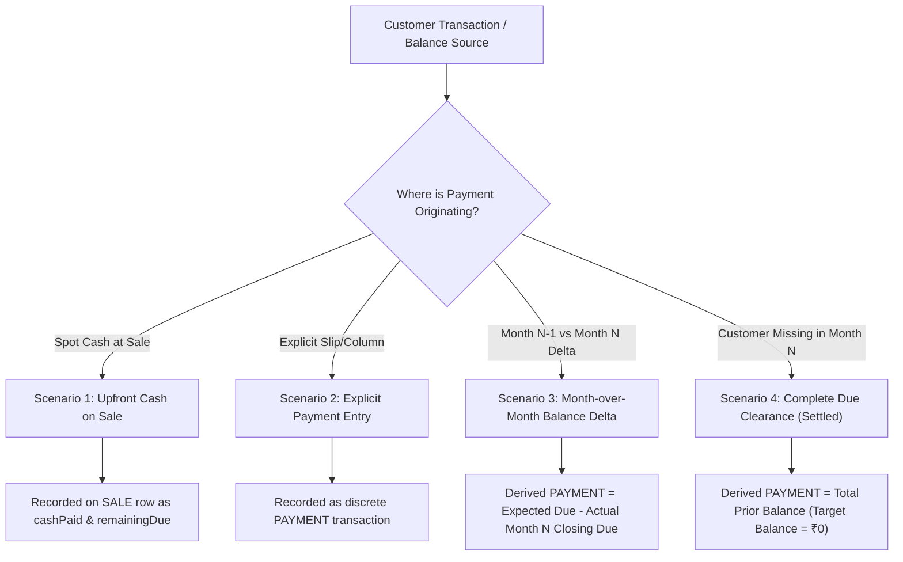

# Customer Payment Reconciliation Scenarios & Accounting Rules

This document outlines the **4 core payment reconciliation scenarios** used to reconstruct exact customer payment events and outstanding balances from Google Sheets into the HaySales offline database.

---

## 1. Overview of Financial Principles

1. **Double-Entry Balance & Single Amount Field**:
   - `amount` is the monetary value.
   - For crop transactions, rate is derived dynamically: $\text{Rate} = \text{Amount} / \text{Weight}$ (₹/Kg).
2. **Customer Balance Formula**:
   $$\text{Customer Balance} = \text{Opening Due} + \sum \text{Sale Dues} + \sum \text{Service Dues} - \sum \text{Payments} - \sum \text{Discounts}$$
3. **Credit Added**:
   $$\text{Remaining Due Added} = \text{Total Sale Amount} - \text{Upfront Cash Paid} - \text{Discount}$$

---

## 2. The 4 Payment Scenarios

---

### Scenario 1: Upfront / Spot Cash on Sale (Strictly SALE Type — NO PAYMENT Type)

- **Source**: `Sales` tab in monthly sheets (_Jan Grass 2025_, _Feb Grass 2025_, etc.).
- **Transaction Type**: Strictly **`SALE`** (or **`SERVICE`**). There is **NO `PAYMENT` transaction type** for spot cash sales.
- **Data Columns**: `Weight`, `Rate`, `Total`, `Cash`, `Debt / Credit`.
- **Accounting Rule**:
  - `Total` = Total sale billing amount.
  - `Cash` = Immediate cash received on the spot at time of sale.
  - `Debt / Remaining` = Net credit added to customer's account:
    $$\text{remainingDue} = \max(0, \text{Total} - \text{Cash})$$
- **Database Representation**:
  - Captured entirely within the single `SALE` record:
    - `type: 'SALE'` *(Never 'PAYMENT')*
    - `amount: Total`
    - `cashPaid: Cash`
    - `remainingDue: Debt`
  - **No separate `PAYMENT` record exists or is created.** Customer ledger increases only by `remainingDue`. If 100% cash sale (`Cash == Total`), `remainingDue = 0` and customer balance remains unaffected.

---

### Scenario 2: Explicit Payment Records (`Credit2`, `Credit3`, `Kasar` in `Customer Credit List-YYYYMMDD`)

- **Source**: `Sheet1` in each **`Customer Credit List-YYYYMMDD`** spreadsheet.
- **Specific Payment Columns**:
  - **`Credit2`**: Explicit payment amount received from the customer during the month.
  - **`Credit3`**: Additional/second payment installment received from the customer during the month.
  - **`Kasar`**: Discount / waiver deducted from customer liability.
  - **`Prv. Credit`**: Cumulative payments brought forward from previous periods.
- **Accounting Rule**:
  - The new payment collected from the customer in month $N$ is:
    $$\text{Payment Amount} = \text{Credit2} + \text{Credit3}$$
    $$\text{Discount / Kasar} = \text{Kasar}$$
  - These payments directly decrease the customer's outstanding balance:
    $$\text{Ending Due} = \text{Total Debt } (\text{Prv. Debt} + \text{Date2} + \text{Date3}) - \text{Total Credit } (\text{Prv. Credit} + \text{Credit2} + \text{Credit3} + \text{Kasar})$$
- **Database Representation**:
  - Stored as an independent `PAYMENT` transaction:
    - `type: 'PAYMENT'`
    - `amount: Credit2 + Credit3`
    - `discount: Kasar` (if $> 0$)
    - `cashPaid: Credit2 + Credit3`
    - `remainingDue: 0`
    - `date: YYYY-MM-DD` (end of month or transaction date)
    - `customerId: <Customer_ID>`

---

### Scenario 3: Month-over-Month Derived Payment (Customer in Both $N-1$ and $N$)

- **Context**: Comparing consecutive monthly credit lists (e.g., **Dec 2024 Closing Credit List** vs. **Jan 2025 Closing Credit List**).
- **Condition**: The customer is present in **both** Month $N-1$ and Month $N$ credit lists.
- **Accounting Formula**:
  1. Let $B_{N-1}$ = Customer's closing balance at Month $N-1$.
  2. Let $S_N$ = New credit sales extended to customer during Month $N$ ($\sum \text{remainingDue}$ from Month $N$ sales).
  3. Let $B_N$ = Customer's recorded closing balance at Month $N$.
  4. **Expected Balance before unlisted payments**:
     $$\text{Expected Due}_N = B_{N-1} + S_N$$
  5. **Derived Payment**:
     $$\text{Derived Payment Amount} = \text{Expected Due}_N - B_N = (B_{N-1} + S_N) - B_N$$
- **Example**:
  - Dec 2024 Closing Due: ₹45,000
  - Jan 2025 New Credit Purchases: ₹15,000
  - Expected Due: ₹60,000
  - Jan 2025 Actual Closing Due: ₹20,000
  - **Derived Payment**: $₹60,000 - ₹20,000 = \mathbf{₹40,000}$ (recorded as a `PAYMENT` transaction during January 2025).

---

### Scenario 4: Complete Due Clearance (Customer Present in $N-1$ but Absent in $N$)

- **Context**: Month $N-1$ credit list has the customer with an outstanding balance, but the customer's name is **completely missing / dropped** from Month $N$'s active credit list.
- **Condition**:
  $$\text{Customer} \in \text{CreditList}_{N-1} \quad \text{AND} \quad \text{Customer} \notin \text{CreditList}_N$$
- **Business & Accounting Meaning**:
  - In credit tracking sheets, when an existing customer no longer appears on the active debtors list for the next month, it means their entire outstanding liability has been **fully cleared / paid off to ₹0**.
- **Accounting Formula**:
  1. Let $B_{N-1}$ = Closing balance from Month $N-1$.
  2. Let $S_N$ = Any new credit sales in Month $N$ (or ₹0 if no sales).
  3. Recorded Ending Due: $B_N = 0$.
  4. **Full Clearance Payment**:
     $$\text{Full Settlement Payment Amount} = B_{N-1} + S_N$$
- **Example**:
  - Dec 2024 Closing Due: ₹32,500
  - Jan 2025 Credit Sales: ₹0
  - Jan 2025 Credit List: _Customer not listed_ (Target Due = ₹0)
  - **Derived Full Payment**: $\mathbf{₹32,500}$ (recorded as a `PAYMENT` transaction dated in Jan 2025, bringing customer balance to ₹0).

---

## 3. Summary Comparison Table

| Scenario                      | Condition / Source                    | Action Taken in HaySales Database                    | Result on Customer Balance               |
| :---------------------------- | :------------------------------------ | :--------------------------------------------------- | :--------------------------------------- |
| **1. Upfront Cash on Sale**   | `Cash` column in `Sales` tab $> 0$    | Stored as `cashPaid` on `SALE` record                | Only net `remainingDue` adds to balance  |
| **2. Explicit Payment Slip**  | Row in `Credit1`/`Credit2`/`Payments` | Creates independent `PAYMENT` record                 | Reduces balance by payment amount        |
| **3. Month-over-Month Delta** | Customer in both $N-1$ & $N$ sheets   | Creates `PAYMENT` record for $(B_{N-1} + S_N) - B_N$ | Reconciles exact ending balance to $B_N$ |
| **4. Complete Clearance**     | Customer in $N-1$, missing in $N$     | Creates `PAYMENT` record for $B_{N-1} + S_N$         | Fully clears balance down to ₹0          |
